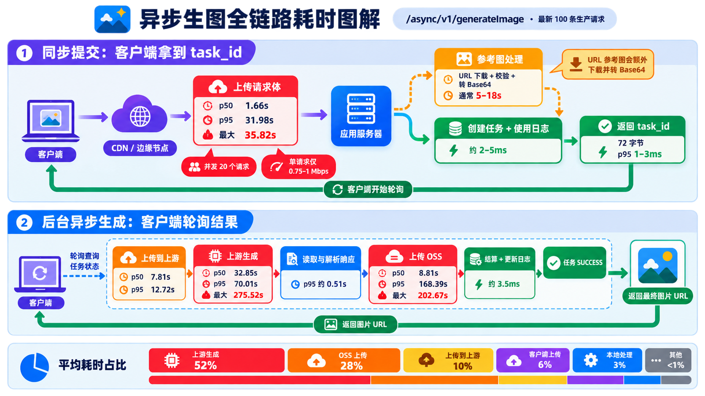

# `/async/v1/generateImage` 全链路检查手册

本文用于快速复查异步生图接口的入口上传、同步提交、上游调用、图片存储和客户端响应耗时。

适用接口：

- `POST /async/v1/generateImage`：提交任务并返回 `task_id`。
- `GET /async/v1/tasks/:task_id`：客户端轮询任务并获取最终图片 URL。

> 注意：提交接口返回的只是约 72 字节的任务信息。图片生成、上游响应和 OSS 上传在后台异步执行，不能把“提交响应耗时”和“图片生成总耗时”混在一起。

## 链路图



## 一、链路阶段

```text
客户端
  → CDN / 边缘节点
  → Nginx
  → Gin 完整读取请求体
  → 参数校验 / 参考图下载 / Base64 转换
  → 计费检查
  → 创建任务和使用日志
  → 返回 task_id

后台异步任务
  → 构造上游请求
  → 上传请求到上游
  → 等待上游生成
  → 读取并解析上游响应
  → 下载上游图片（URL 响应时）
  → 上传 OSS
  → 结算、更新任务和使用日志
  → 客户端轮询得到最终图片 URL
```

## 二、日志位置

| 数据源 | 位置 | 用途 |
|---|---|---|
| 应用日志 | `logs/oneapi-*.log` | 精确分阶段耗时、任务 ID、请求 ID、渠道和模型 |
| `.cn` Nginx 日志 | `/var/log/nginx/origin_timing.log` | `api.o1key.cn` 的客户端入口和下行响应耗时 |
| `.com`/Cloudflare Nginx 日志 | `/var/log/nginx/cf_origin_timing.log` | `api.o1key.com`、`cf-api.o1key.com` 的入口耗时 |
| PostgreSQL | `tasks` 表 | 任务状态、渠道、模型、开始和完成时间 |
| 容器实时日志 | `docker logs new-api` | 部署后立即追踪当前请求 |

应用日志时间通常显示为 UTC+8，Nginx `time` 字段为带时区 ISO 时间。跨日志分析优先使用 `request_id`，不要只按显示时间关联。

`cf_origin_timing.log` 中的 `/tmp/output/*` 只能测量“本机源站 → Cloudflare 边缘节点”的回源传输。Cloudflare 缓存命中不会访问源站，因此该日志不能直接代表“Cloudflare 边缘节点 → 最终客户端”的完整下载速度。

## 三、五分钟快速检查

### 1. 确认服务健康

```bash
docker inspect new-api --format '{{.State.Status}} {{if .State.Health}}{{.State.Health.Status}}{{end}} {{.Image}}'
```

期望输出包含：

```text
running healthy
```

### 2. 实时观察生图分阶段日志

```bash
docker logs new-api --since 10m
```

只筛选生图计时日志：

```bash
docker logs new-api --since 10m 2>&1 | rg 'generate_image_timing'
```

持续观察持久化日志：

```bash
tail -F logs/oneapi-*.log | rg --line-buffered 'generate_image_timing|POST /async/v1/generateImage'
```

### 3. 查看最新生图任务状态

```bash
docker exec postgres psql -U root -d new-api -P pager=off -c "
SELECT id, task_id, status, channel_id,
       to_timestamp(submit_time) AS submitted,
       finish_time - start_time AS task_seconds
FROM tasks
WHERE platform = 'generate_image'
ORDER BY id DESC
LIMIT 20;
"
```

### 4. 查看入口请求

`.cn`：

```bash
sudo tail -1000 /var/log/nginx/origin_timing.log | jq -c 'select(.uri == "/async/v1/generateImage")'
```

`.com`/Cloudflare：

```bash
sudo tail -1000 /var/log/nginx/cf_origin_timing.log | jq -c 'select(.uri == "/async/v1/generateImage")'
```

重点字段：

- `app_request_id`：与应用日志关联。
- `host`：区分 `.cn` 与 `.com` 链路。
- `request_length`：客户端请求大小。
- `request_time`：Nginx 看到的完整请求耗时。
- `upstream_header_time`：Nginx 等待应用响应头的时间。
- `upstream_response_time`：Nginx 与应用通信的总时间。
- `body_bytes_sent`：返回客户端的响应体大小。
- `request_completion`：正常请求应为 `OK`。

## 四、按单条请求完整追踪

先从任务、Nginx 或应用日志中取得请求 ID：

```bash
GEN_IMG_RID='这里填写 request_id'
```

### 应用日志

```bash
rg -F "$GEN_IMG_RID" logs
```

### Nginx 日志

```bash
rg -F "\"app_request_id\":\"$GEN_IMG_RID\"" \
  /var/log/nginx/origin_timing.log \
  /var/log/nginx/cf_origin_timing.log
```

### 数据库任务

```bash
docker exec postgres psql -U root -d new-api -P pager=off -c "
SELECT id, task_id, status, channel_id, submit_time, start_time, finish_time,
       properties, private_data
FROM tasks
WHERE platform = 'generate_image'
  AND private_data::jsonb->>'request_id' = '$GEN_IMG_RID';
"
```

不要把上述查询的 `private_data`、完整图片 URL 或任何密钥复制到公开聊天或工单。

## 五、应用计时字段说明

### 1. `phase=submit`

从客户端请求进入应用，到返回 `task_id` 之前：

| 字段 | 含义 |
|---|---|
| `request_bytes` | 应用实际收到的请求体大小 |
| `body_receive_ms` | 客户端/边缘节点把请求体传到应用的耗时 |
| `decode_validate_ms` | JSON 解码、字段校验和部分参考图校验 |
| `billing_ms` | 计费检查和预扣费 |
| `prepare_ms` | 参考图下载、转换、构造上游请求数据 |
| `task_insert_ms` | 插入任务记录 |
| `submit_log_ms` | 创建提交时使用日志 |
| `task_update_ms` | 更新任务扩展信息 |
| `post_body_submit_ms` | 请求体完整后，到提交处理完成的总耗时 |
| `total_submit_ms` | 从应用收到请求到准备返回 `task_id` 的总耗时 |

判断方法：

- `body_receive_ms` 大：客户端、CDN 或边缘到源站的上传链路慢。
- `decode_validate_ms`/`prepare_ms` 大且请求体很小：通常是 URL 参考图下载或转换慢。
- `submit_log_ms` 大：数据库日志写入异常；正常约 1～3ms。
- `total_submit_ms ≈ body_receive_ms`：主要是客户端上传慢。
- `total_submit_ms - body_receive_ms` 大：主要是服务器预处理慢。

### 2. `phase=upstream_headers`

本服务器向模型上游发送请求并拿到响应头：

| 字段 | 含义 |
|---|---|
| `request_bytes` | 发送给上游的请求大小 |
| `dns_ms` | DNS 查询 |
| `connect_ms` | TCP 建连 |
| `tls_ms` | TLS 握手 |
| `connection_wait_ms` | 等待可用连接的总时间 |
| `request_write_ms` | 把请求体写给上游的时间 |
| `request_mbps` | 请求上传有效速率 |
| `upstream_wait_ms` | 请求写完后等待上游首字节，即模型生成等待 |
| `response_header_ms` | 首字节到响应头完整返回 |
| `transport_attempts` | HTTP 传输尝试次数 |
| `conn_reused` | 是否复用连接 |

判断方法：

- `dns/connect/tls` 大：域名解析、线路或握手问题。
- `request_write_ms` 大：服务器到上游的上传带宽不足，常见于 10～41MiB 的 Gemini inline base64 请求。
- `upstream_wait_ms` 大：上游生成或上游排队慢。
- `transport_attempts > 1`：底层发生重试。

### 3. `phase=upstream_body`

- `body_bytes`：上游响应体大小。
- `body_read_ms`：服务器读完上游响应体的耗时。
- `read_error`：是否读取失败。

### 4. `phase=response_parse`

- `parse_ms`：解析上游 JSON 和抽取图片数据的耗时。
- 正常为毫秒级，通常不是主要瓶颈。

### 5. `phase=output_storage`

| 字段 | 含义 |
|---|---|
| `source_base64` | 上游直接返回 Base64 图片数量 |
| `source_url` | 上游返回 URL 图片数量 |
| `download_ms` | 下载上游 URL 图片的时间 |
| `upload_ms` | 上传对象存储的总时间 |
| `upload_mbps` | 对象存储上传速率 |
| `upload_transport_attempts` | OSS HTTP 传输次数 |
| `upload_connection_wait_ms` | OSS 连接等待 |
| `upload_request_write_ms` | 图片数据发送到 OSS 的时间 |
| `upload_server_wait_ms` | 图片发送完后等待 OSS 响应的时间 |
| `output_bytes` | 最终上传图片大小 |
| `storage_error` | 存储是否失败 |

判断方法：

- `upload_transport_attempts > 1`：SDK 或底层 HTTP 重试。
- `upload_connection_wait_ms` 大：到 OSS 的 DNS、连接或连接池问题。
- `upload_request_write_ms` 大：服务器到 OSS 的发送链路慢。
- `upload_server_wait_ms` 大：OSS 服务端确认慢。
- 总上传很慢但并发为 1：不是本机并发队列问题。

### 6. `phase=finalize`

| 字段 | 含义 |
|---|---|
| `result_update_ms` | 写任务结果 |
| `billing_ms` | 最终结算 |
| `refund_check_ms` | 零用量退款检查 |
| `log_update_ms` | 更新使用日志 |
| `metadata_update_ms` | 更新上游模型等元数据 |
| `total_ms` | 最终完成阶段总时间 |

正常总计约 2～7ms。

## 六、客户端下行响应检查

提交接口只返回 `task_id`，当前响应体约 72 字节。

精确判断：

1. 在应用 `[GIN]` 日志中取得接口总耗时。
2. 在同一个 `request_id` 的 Nginx 日志中取得 `request_time`。
3. 计算：

```text
Nginx 下行与代理尾部开销 ≈ request_time - Gin 总耗时
```

粗略判断：

```text
响应头后到请求完成 ≈ request_time - upstream_header_time
```

因为 Nginx 字段只有毫秒精度，差值偶尔出现 `-1ms` 到 `-6ms` 属于舍入误差。

当前基线：

- Gin 完成到 Nginx 发完响应：p50 约 `0.35ms`。
- p95 约 `1.11ms`。
- 最大约 `1.50ms`。
- 全量 Nginx 粗粒度 p95 约 `3ms`。

如果这里持续超过 `50ms`，才需要检查客户端下行、CDN 回传或连接异常。

### 6.1 本机图片经 Cloudflare 回源的速度

抽取最近 100 次 CF 图片回源：

```bash
sudo tail -100000 /var/log/nginx/cf_origin_timing.log \
  | jq -r 'select(.host == "cf-api.o1key.com" and (.uri | startswith("/tmp/output/")))
    | [.time, .status, .body_bytes_sent, .request_time,
       (if .request_time > 0 then (.body_bytes_sent * 8 / .request_time / 1000000) else null end),
       .request_completion] | @tsv' \
  | tail -100
```

输出列依次为：时间、状态码、响应字节数、源站请求时间、估算 Mbps、请求是否完整。

判断标准：

- `status=200` 且 `request_completion=OK`：本机到 CF 的文件传输完整。
- `request_time`：本机把文件交付给 CF 节点的时间，不是最终用户下载时间。
- `origin_mbps = body_bytes_sent × 8 ÷ request_time ÷ 1,000,000`。
- 当前 100 条 CF 基线：P50 `23.5ms`、P95 `80ms`、最大 `131ms`，100 条全部为 `200/OK`。

### 6.2 最终客户端实际下载速度

可以监控，但必须在客户端或 Cloudflare 边缘侧补充数据。源站日志无法看到缓存命中请求，也无法看到 CF 节点到最终用户的网络阶段。

推荐同时保留三层指标：

| 层级 | 数据来源 | 能回答的问题 |
|---|---|---|
| 本机 → CF | `cf_origin_timing.log` | 源站磁盘读取和 CF 回源是否慢 |
| CF 边缘 | Cloudflare HTTP 日志/Logpush | 缓存 HIT/MISS、边缘状态、区域和边缘处理时间 |
| CF → 客户端 | 浏览器 Resource Timing 或 SDK 主动上报 | 用户实际 TTFB、完整下载时间、文件大小和 Mbps |

浏览器侧应采集：

- `responseStart - startTime`：图片下载 TTFB。
- `responseEnd - responseStart`：响应体下载时间。
- `decodedBodySize`：图片内容大小。
- `transferSize`：实际网络传输大小；浏览器缓存命中时可能为 `0`。
- `client_mbps = decodedBodySize × 8 ÷ download_ms ÷ 1000`。
- 客户端网络类型、国家/地区、CF 缓存状态和采样时间；不要上报完整图片 UUID 或用户隐私数据。

跨域图片要读取完整 Resource Timing 字段，`/tmp/output/*` 响应需要增加：

```http
Timing-Allow-Origin: *
```

如果下游不是浏览器，应由 SDK 在开始下载、收到响应头和读完响应体时分别打点，再把匿名聚合指标上报到监控接口。建议先按 5%～10% 采样，统计每个地区的 P50/P90/P95 下载 Mbps、TTFB、失败率和缓存命中率。

## 七、告警和排查阈值

| 阶段 | 注意 | 严重 | 首要检查 |
|---|---:|---:|---|
| `body_receive_ms` | > 10s | > 30s | 客户端并发、客户端带宽、CDN/边缘回源 |
| `decode_validate_ms + prepare_ms` | > 5s | > 15s | 参考图 URL、下载源站、图片大小 |
| `request_write_ms` | > 10s | > 30s | 上游请求大小、Base64 膨胀、服务器出口带宽 |
| `upstream_wait_ms` | > 60s | > 120s | 上游模型排队或生成速度 |
| `body_read_ms` | > 2s | > 10s | 上游响应体大小、下载链路 |
| `upload_ms` | > 30s | > 100s | OSS 连接、发送、响应和重试 |
| `finalize total_ms` | > 50ms | > 500ms | DB、计费、日志库 |
| 服务端到客户端尾部 | > 20ms | > 50ms | Nginx、CDN、客户端下行 |

## 八、根因速查表

| 现象 | 可以下的结论 |
|---|---|
| 大请求，`body_receive_ms` 占总提交绝大部分 | 客户端/边缘上传慢 |
| 多个请求同时开始，单请求 Mbps 下降但聚合带宽稳定 | 客户端批量并发共享上传带宽 |
| 请求只有几百字节，但提交耗时 5～18s | URL 参考图下载、校验和 Base64 转换慢 |
| `request_write_ms` 随上游请求大小增长 | 服务器到上游上传带宽瓶颈 |
| `upstream_wait_ms` 最大 | 上游生成或排队慢 |
| `upload_request_write_ms` 最大且只有一次传输 | 服务器到 OSS 的发送链路慢 |
| `upload_server_wait_ms` 最大 | OSS 服务端响应慢 |
| `upload_transport_attempts > 1` | OSS SDK/HTTP 发生重试 |
| `submit_log_ms` 和 `finalize` 都是毫秒级 | 使用日志数据库不是延迟根因 |
| Nginx 与 Gin 总耗时相差仅 1～3ms | Nginx 和服务器到客户端不是瓶颈 |

## 九、排查原则

1. 先区分同步提交慢，还是异步生成慢。
2. 同步提交先看 `body_receive_ms`，再看 `decode_validate_ms` 和 `prepare_ms`。
3. 异步任务先比较 `request_write_ms`、`upstream_wait_ms` 和 `upload_ms`。
4. 所有判断必须用同一个 `request_id` 关联 Nginx、应用和数据库。
5. 不要通过任务秒级时间推测网络阶段；优先使用精确毫秒计时字段。
6. 批量请求必须同时看单请求 Mbps、总并发和聚合带宽。
7. OSS 慢请求必须检查传输次数，区分重试、连接、发送和服务端等待。
8. 报告中同时给出分位数和具体异常样本，避免被平均值掩盖。
